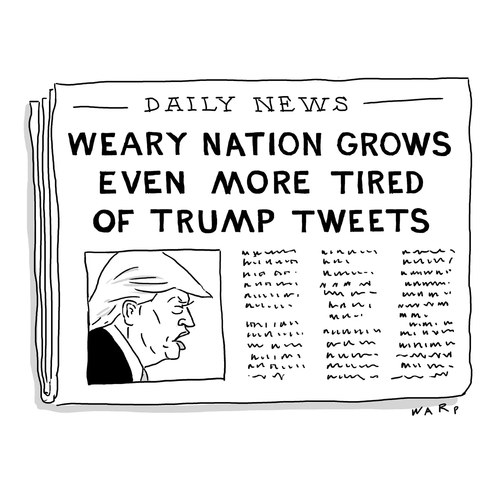
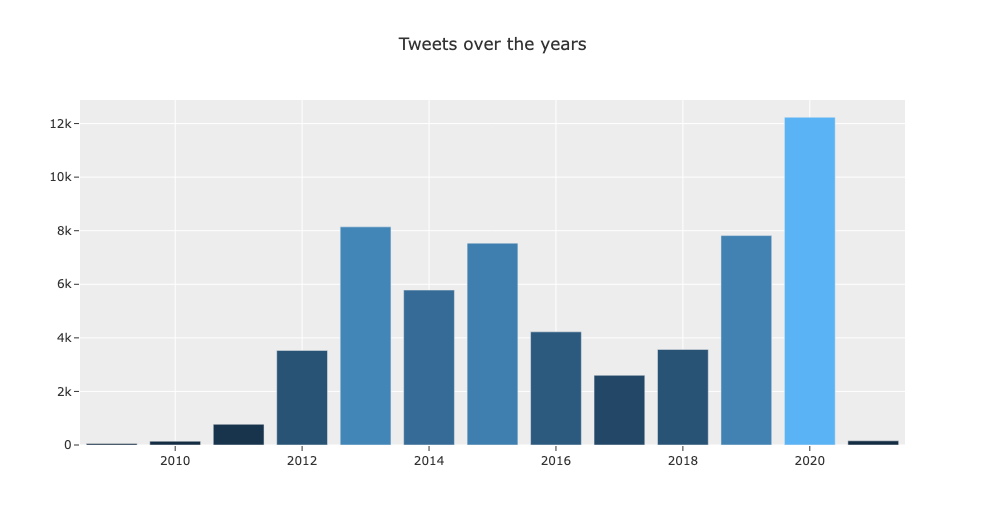
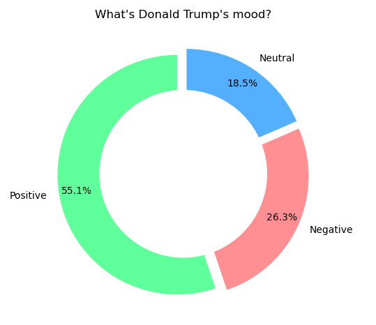
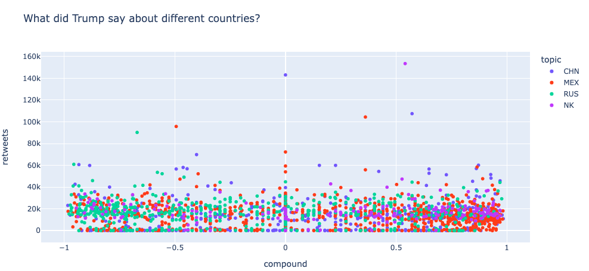
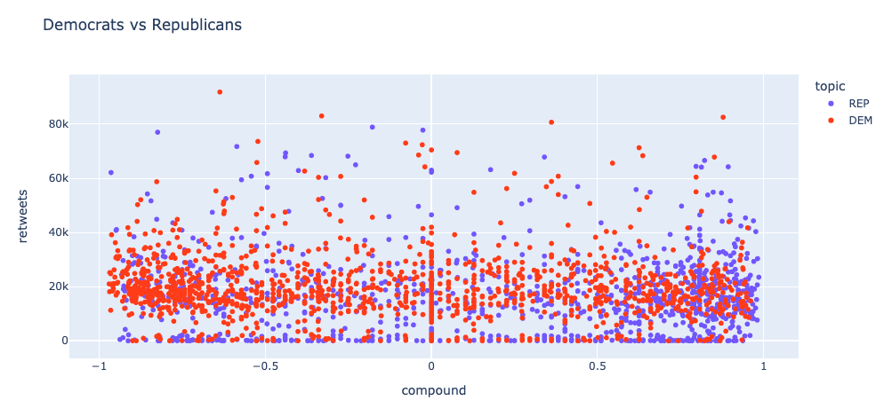
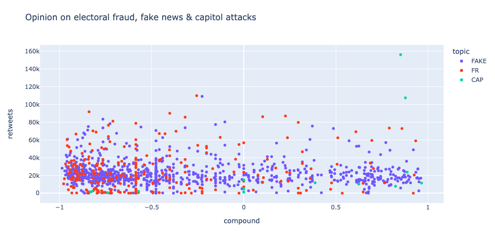
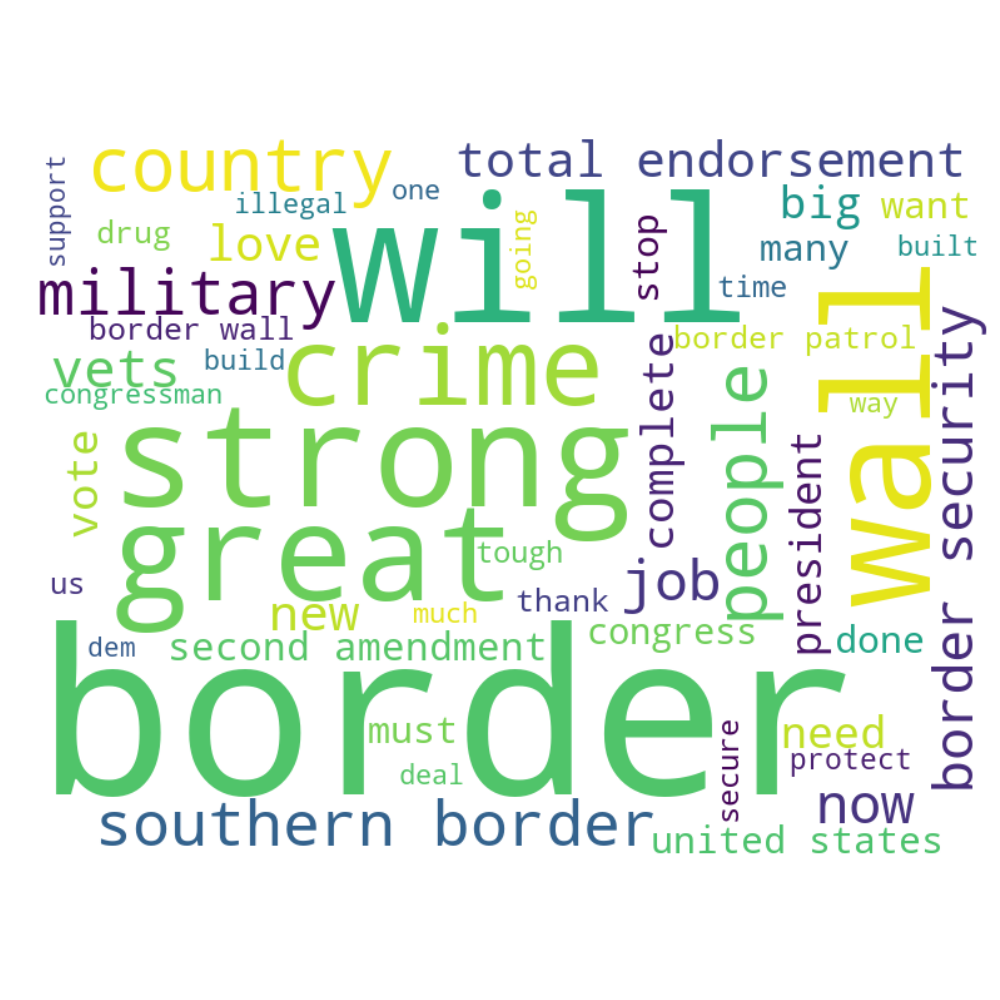

  <h3 align="center"> 🚨🐦 An analysis on Donald Trump's tweets 🐦🚨</h3>

  <h6 align="center">
    Ironhack: project IV

## Table of contents

- [Introduction](#introduction)
- [Data](#data)
- [Sentiment Analysis](#sentiment-analysis)
- [API & SQL](#api--sql)  
- [Digging into specific topics](#digging-into-specific-topics)
- [References](#references)

### Introduction

There is no doubt that Donald Trump has been a very controversial and polarizing figure in the United States, especially since he announced his run for the presidency in 2015. Throughout his presidency, Donald Trump has used Twitter as a powerful tool to reach his supporters. The social media service has, without a doubt, been one of his most powerful tools.

Trump’s Twitter activity was very high between 2013 and 2016, then decreased after the start of his presidency. However, Trump steadily increased his activity since the start of 2019 until January 2021, when he got banned from Twitter due to the attacks on the Capitol by his supporters.

The dataframe obtained from Kaggle had all of his tweets from 2009-2021, with a total of **56,571 tweets** 🤯

### Sentiment analysis

I calculated the sentiment analysis of Trump's tweets grading them by positive, negative, neutral and an average called compound, with the **natural language toolkit library**. 

As we can see in the next  graph, most of Trump's tweets are positive, and few of them are neutral. 

### API & SQL

After doing the sentiment analysis, I uploaded my dataframe to SQL and created my own API to request different queries and to post new ones. 

##### Queries 

1. All the table: http://127.0.0.1:9012/sql/
2. Only positive tweets and retweets: http://127.0.0.1:9012/pos/ 
3. Only negative tweets and retweets: http://127.0.0.1:9012/neg/ 
4. Tweets ordered by number of favorites: http://127.0.0.1:9012/fav/
5. Tweets ordered by number of retweets: http://127.0.0.1:9012/retweets/
6. Tweets for different years and ordered by popularity: http://127.0.0.1:9012/year/2020

##### Posting

1. I posted a tweet for 2022 (Trump was already banned): http://127.0.0.1:9012/year/2022

### Digging into specific topics

Then, I looked for different words in Trump's tweets to analyze the sentiment on different topics, like: 

* Sentiments towards different **countries**: Mexico, China & North Korea.

* Sentiments towards both of the **political parties** of the USA: republicans & democrats.

* Opinions on **electoral fraud, fake news and capitol attacks** on 2021. 

### Wordcloud

I did a wordcloud to show the most repeated words in tweets that talked about Mexico.  

##### Mexico

#### Conclusions

### References

- https://www.kaggle.com/datasets/zusmani/trumps-legacy